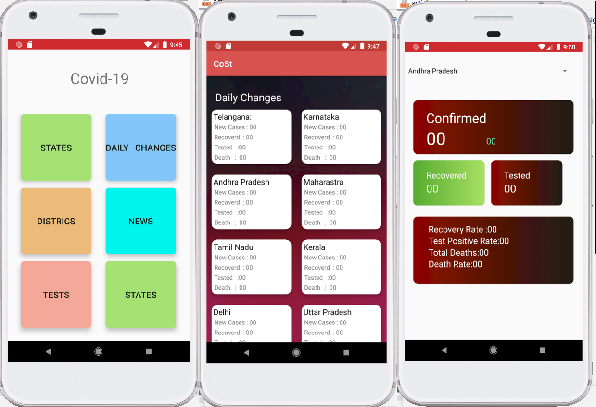

# GeoCovid : Covid-19 Live App

## Overview
The **Covid-19 Live App** is an **essential resource** in the fight against the pandemic, designed to keep the public **informed** with the **latest developments** in the COVID-19 situation. This **mobile application** leverages **RESTful APIs** to provide **real-time, accurate**, and **location-specific data** on COVID-19 statistics. Utilizing the **Maps API**, it delivers **personalized information** based on the user's **geographical location**, detailing confirmed cases, recoveries, active cases, and fatalities.

In addition, the integration with the **Google News API** ensures a continuous feed of pertinent **news articles**, equipping users with a comprehensive understanding of the pandemic's **global impact** and response efforts. The app's collaboration with the **COVID-19 India API** offers **up-to-date** and **detailed statistics**, making it a pivotal tool for a **well-informed community**.

The Covid-19 Live App is more than just an informational tool; it is a **gateway** to data-driven insights and current events, serving as a **crucial instrument** for **public health education** and **personal awareness**. It empowers users to make **informed decisions** and stay one step ahead in these challenging times.


## Features
- **Location-Based Statistics**: Get COVID-19 data for your specific region.
- **Real-Time Updates**: Stay informed with the most recent pandemic data.
- **Daily Changes**: Track new cases, recoveries, tests, and deaths daily.
- **News Integration**: Read the latest COVID-19 news articles.
- **User-Friendly Interface**: An intuitive UI for easy navigation.

## APIs Used
- **Maps API**: For fetching location-based data.
- **Google News API**: For retrieving the latest news on COVID-19.
- **COVID-19 India API**: Data sourced from [COVID19India API](https://github.com/covid19india/api).

## Screenshots



## Installation
Clone the repository to your local machine:

```bash
git clone https://github.com/nvhs/Covid-19-Live-App-.git
